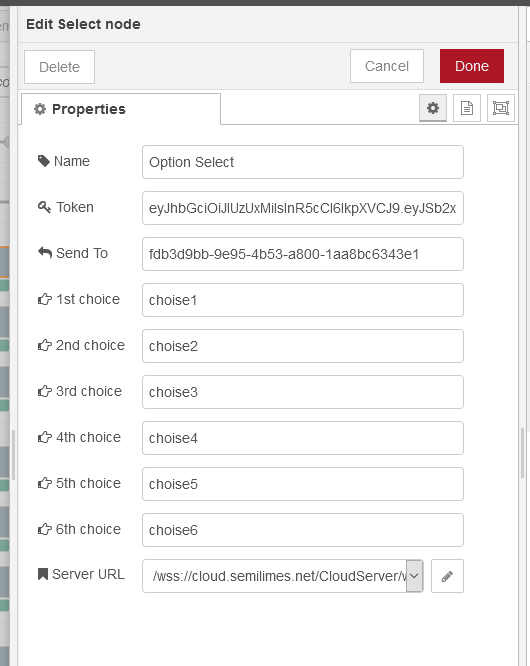
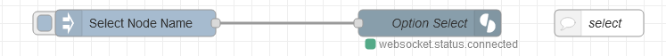
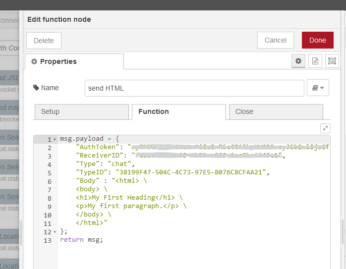

# semilimes MESH connector nodes for Node-RED
     

This package contains receiver, sender and few other nodes which act as connectors to a semilimes channel
The only thing required is the `token` and the `Channel ID` that can be retrieved by the semilimes app.

# Installation

You can install the nodes using node-red's "Manage palette" in the side bar.

Or run the following command in the root directory of your Node-RED installation

    npm install node-red-semilimes-connector --save

# Installation of the mobile apps
- IOS semilimes Messenger :   

- Google Play semilimes Messenger :   

# Dependencies
The nodes are tested with `Node.js v10.23.0` and `Node-RED v1.2.6`.
# Usage
## Basics
Every semilimes node should be configured entering the *Token* and the *Send To* ID that can be retreived within the semilimes mobile app. In order to enable the node to connect to semilimes, the server URL has to be provided: wss://cloud.semilimes.net/CloudServer/wsclient 

Other fields could be present depending on the selected node type. Those fields can be used and are overwritten if a JSON is passed to the input port.
Node-Red can communicate directly with a user or send and receive messages from a channel. Channels can be created from the semilimes app and function as virtual users with their own ID. It is possible to create a channel dedicated to Node-Red, where all messages between users and machines will be published.

### Types of semilimes messages

The following message contents can be sent and received 
- **Send msg** - content is text
- **Receive msg** - content is a JSON object and depends on the message type
- **Select** - content is a title followed by buttons to make a choice
- **Send Location** - content is an object with latitude and longitude
- **Send HTML** - content is an object that embed an HTML script
- **Receive Location** - content is an object that enable the user to choose a location
- **Receive Date** - content is an object that enable the user to choose a Date
- **Receive Time** - content is an object that enable the user to choose a Time
- **Send JSON** - content is a JSON and depends on the msg type (check the semilimes API)

### Receive msg - node
The *semilimes receive msg* node receives messages from the channel and outputs a JSON object. The content of the message depends on the message sent from the channel. 

- ***Name***: is the name of the node
- ***Source Filter***: Filters messages returning only those coming from the indicated UserID or ChannelID. If this field is left blank, you will receive messages from all your contacts and the channels you are subscribed to.
- ***Server URL***: is the semilimes server URL

For a simple text message, the received payload contain the following fields:
{
    “Type”: “chat”,
    “Body” : “Normal text message content.”,
}

`msg.payload` contains the message details with the following elements:
- ***type*** : The type of message received. Types see table below
- ***Body*** : Received message content

A simple flow to read the message caming from semilimes channel and show it in the debug windows:

And this is how the ouput in the Debug windows looks like:

### Send msg - node
The *semilimes send msg* node send a text messages to a specified channel. TO be able to work it should be configured with the Token and the Receiver ID (the ID of the channel):

- ***Name***: is the name of the node
- ***Token***: is the Auth Token to be retreived from the semilimes server
- ***Send to***: is the channel ID
- ***Destination***: you have to choose whether to send the message to a user or to a channel
- ***Server URL***: is the semilimes server URL

Once the node is properly configured it can be used to send a simple text message. The string should be send to the input of the node, like the following example where the timestamps is sent as message.

### Select - node
The *semilimes Select* node is used to send a choice to the selected channel in form of buttons. When the user press one button, a message is sent back to the Node-Red receive msg node, containing other information about the message and also the choice made. 
The configuration windows of the node has some fields to be filled in order to work.

- ***Name***: is the name of the node
- ***Token***: is the Auth Token to be retreived from the semilimes server
- ***Send to***: is the channel ID
- ***Destination***: you have to choose whether to send the message to a user or to a channel
- ***1 to 6 choice***: is the text to be embedded in the n button
- ***Server URL***: is the semilimes server URL

The simplest way to use the select node is to fill the fields that you need and trigger it sending a string to the input. The input string will be the message text that will appear in the channel, over the choice buttons. It's not necessary to fill all the six choices, whether only two choices are neededed just fill two choices field and send only two buttons.

To have more control on the node, it's also possible to feed it with a JSON object which describes the functionality. In this case the choice fields in the configuration will be overwritten by the JSON. 

### Send Location - node
The *semilimes Send Location* node is used to send a location to the selected channel, it will be displayed as a marker on a map. The configuration windows of the node has some fields to be filled in order to work.

- ***Name***: is the name of the node
- ***Token***: is the Auth Token to be retreived from the semilimes server
- ***Send to***: is the channel ID
- ***Destination***: you have to choose whether to send the message to a user or to a channel
- ***Latitude***: is the latitude of the location
- ***Longitude***: is the longitude of the location
- ***Server URL***: is the semilimes server URL

The simplest way to use the send location node is to fill the fields that you need and trigger its input.

To have more control on the node, it's also possible to feed it with a JSON object which describes the functionality. In this case the choice fields in the configuration will be overwritten by the JSON. 

### Send HTML - node
The *semilimes Send HTML* node is used to embed and send an HTML script within a message, the HTML will be rendered in the channel. The configuration windows of the node has some fields to be filled in order to work.

- ***Name***: is the name of the node
- ***Token***: is the Auth Token to be retreived from the semilimes server
- ***Send to***: is the channel ID
- ***Destination***: you have to choose whether to send the message to a user or to a channel
- ***Server URL***: is the semilimes server URL

In order to use the node it is necessary to feed it with a JSON object which describes the functionality.

### Receive Location - node
The *semilimes Receive Location* node is meant to permit the user to choose a location on the map. Sending this message on a selected channel, a map will be shown and a user could pick a place on the map and send it back to Node-Red receiver node. The configuration windows of the node has some fields to be filled in order to work.

- ***Name***: is the name of the node
- ***Token***: is the Auth Token to be retreived from the semilimes server
- ***Send to***: is the channel ID
- ***Destination***: you have to choose whether to send the message to a user or to a channel
- ***Server URL***: is the semilimes server URL

In order to use the node it is necessary to feed it with a string which will be the text part of the message. 

### Receive Date - node
The *semilimes Receive Date* node is meant to permit the user to choose a date. Sending this message on a selected channel, a calendar will be shown and a user could pick a date and send it back to Node-Red receiver node. The configuration windows of the node has some fields to be filled in order to work.

- ***Name***: is the name of the node
- ***Token***: is the Auth Token to be retreived from the semilimes server
- ***Send to***: is the channel ID
- ***Destination***: you have to choose whether to send the message to a user or to a channel
- ***Server URL***: is the semilimes server URL

In order to use the node it is necessary to feed it with a string which will be the text part of the message. 

### Receive Time - node
The *semilimes Time Picker* node is meant to permit the user to choose a time. Sending this message on a selected channel, a clock will be shown and a user could pick a time and send it back to Node-Red receiver node. The configuration windows of the node has some fields to be filled in order to work.

- ***Name***: is the name of the node
- ***Token***: is the Auth Token to be retreived from the semilimes server
- ***Send to***: is the channel ID
- ***Destination***: you have to choose whether to send the message to a user or to a channel
- ***Server URL***: is the semilimes server URL

In order to use the node it is necessary to feed it with a string which will be the text part of the message. 

### Send JSON - node
The *semilimes Send JSON* node is ment to be used to connect to the server sending the whole JSON message. To use this node you have to check the semilimes API for the syntax and the message type that could be sent.The configuration windows of the node has only two fields to be filled in order to work.

- ***Name***: is the name of the node
- ***Server URL***: is the semilimes server URL

This node could be used to send any kind of message supported by the API, the following is an example flow which sends an HTML script embedded into the message. 

# Support 
If you want to support this free project. Any help is welcome. You can donate by clicking one of the following link:

# License
Author: Flavio Ansovini

Apache License
Version 2.0, January 2004
http://www.apache.org/licenses/
TERMS AND CONDITIONS FOR USE, REPRODUCTION, AND DISTRIBUTION

1. Definitions.
"License" shall mean the terms and conditions for use, reproduction, and distribution as defined by Sections 1 through 9 of this document.
"Licensor" shall mean the copyright owner or entity authorized by the copyright owner that is granting the License.
"Legal Entity" shall mean the union of the acting entity and all other entities that control, are controlled by, or are under common control with that entity. For the purposes of this definition, "control" means (i) the power, direct or indirect, to cause the direction or management of such entity, whether by contract or otherwise, or (ii) ownership of fifty percent (50%) or more of the outstanding shares, or (iii) beneficial ownership of such entity.
"You" (or "Your") shall mean an individual or Legal Entity exercising permissions granted by this License.
"Source" form shall mean the preferred form for making modifications, including but not limited to software source code, documentation source, and configuration files.
"Object" form shall mean any form resulting from mechanical transformation or translation of a Source form, including but not limited to compiled object code, generated documentation, and conversions to other media types.
"Work" shall mean the work of authorship, whether in Source or Object form, made available under the License, as indicated by a copyright notice that is included in or attached to the work (an example is provided in the Appendix below).
"Derivative Works" shall mean any work, whether in Source or Object form, that is based on (or derived from) the Work and for which the editorial revisions, annotations, elaborations, or other modifications represent, as a whole, an original work of authorship. For the purposes of this License, Derivative Works shall not include works that remain separable from, or merely link (or bind by name) to the interfaces of, the Work and Derivative Works thereof.
"Contribution" shall mean any work of authorship, including the original version of the Work and any modifications or additions to that Work or Derivative Works thereof, that is intentionally submitted to Licensor for inclusion in the Work by the copyright owner or by an individual or Legal Entity authorized to submit on behalf of the copyright owner. For the purposes of this definition, "submitted" means any form of electronic, verbal, or written communication sent to the Licensor or its representatives, including but not limited to communication on electronic mailing lists, source code control systems, and issue tracking systems that are managed by, or on behalf of, the Licensor for the purpose of discussing and improving the Work, but excluding communication that is conspicuously marked or otherwise designated in writing by the copyright owner as "Not a Contribution."
"Contributor" shall mean Licensor and any individual or Legal Entity on behalf of whom a Contribution has been received by Licensor and subsequently incorporated within the Work.

2. Grant of Copyright License. Subject to the terms and conditions of this License, each Contributor hereby grants to You a perpetual, worldwide, non-exclusive, no-charge, royalty-free, irrevocable copyright license to reproduce, prepare Derivative Works of, publicly display, publicly perform, sublicense, and distribute the Work and such Derivative Works in Source or Object form.

3. Grant of Patent License. Subject to the terms and conditions of this License, each Contributor hereby grants to You a perpetual, worldwide, non-exclusive, no-charge, royalty-free, irrevocable (except as stated in this section) patent license to make, have made, use, offer to sell, sell, import, and otherwise transfer the Work, where such license applies only to those patent claims licensable by such Contributor that are necessarily infringed by their Contribution(s) alone or by combination of their Contribution(s) with the Work to which such Contribution(s) was submitted. If You institute patent litigation against any entity (including a cross-claim or counterclaim in a lawsuit) alleging that the Work or a Contribution incorporated within the Work constitutes direct or contributory patent infringement, then any patent licenses granted to You under this License for that Work shall terminate as of the date such litigation is filed.

4. Redistribution. You may reproduce and distribute copies of the Work or Derivative Works thereof in any medium, with or without modifications, and in Source or Object form, provided that You meet the following conditions:
    You must give any other recipients of the Work or Derivative Works a copy of this License; and
    You must cause any modified files to carry prominent notices stating that You changed the files; and
    You must retain, in the Source form of any Derivative Works that You distribute, all copyright, patent, trademark, and attribution notices from the Source form of the Work, excluding those notices that do not pertain to any part of the Derivative Works; and
    If the Work includes a "NOTICE" text file as part of its distribution, then any Derivative Works that You distribute must include a readable copy of the attribution notices contained within such NOTICE file, excluding those notices that do not pertain to any part of the Derivative Works, in at least one of the following places: within a NOTICE text file distributed as part of the Derivative Works; within the Source form or documentation, if provided along with the Derivative Works; or, within a display generated by the Derivative Works, if and wherever such third-party notices normally appear. The contents of the NOTICE file are for informational purposes only and do not modify the License. You may add Your own attribution notices within Derivative Works that You distribute, alongside or as an addendum to the NOTICE text from the Work, provided that such additional attribution notices cannot be construed as modifying the License.
    You may add Your own copyright statement to Your modifications and may provide additional or different license terms and conditions for use, reproduction, or distribution of Your modifications, or for any such Derivative Works as a whole, provided Your use, reproduction, and distribution of the Work otherwise complies with the conditions stated in this License.

5. Submission of Contributions. Unless You explicitly state otherwise, any Contribution intentionally submitted for inclusion in the Work by You to the Licensor shall be under the terms and conditions of this License, without any additional terms or conditions. Notwithstanding the above, nothing herein shall supersede or modify the terms of any separate license agreement you may have executed with Licensor regarding such Contributions.

6. Trademarks. This License does not grant permission to use the trade names, trademarks, service marks, or product names of the Licensor, except as required for reasonable and customary use in describing the origin of the Work and reproducing the content of the NOTICE file.

7. Disclaimer of Warranty. Unless required by applicable law or agreed to in writing, Licensor provides the Work (and each Contributor provides its Contributions) on an "AS IS" BASIS, WITHOUT WARRANTIES OR CONDITIONS OF ANY KIND, eother express or implied, including, without limitation, any warranties or conditions of TITLE, NON-INFRINGEMENT, MERCHANTABILITY, or FITNESS FOR A PARTICULAR PURPOSE. You are solely responsible for determining the appropriateness of using or redistributing the Work and assume any risks associated with Your exercise of permissions under this License.

8. Limitation of Liability. In no event and under no legal theory, whether in tort (including negligence), contract, or otherwise, unless required by applicable law (such as deliberate and grossly negligent acts) or agreed to in writing, shall any Contributor be liable to You for damages, including any direct, indirect, special, incidental, or consequential damages of any character arising as a result of this License or out of the use or inability to use the Work (including but not limited to damages for loss of goodwill, work stoppage, computer failure or malfunction, or any and all other commercial damages or losses), even if such Contributor has been advised of the possibility of such damages.

9. Accepting Warranty or Additional Liability. While redistributing the Work or Derivative Works thereof, You may choose to offer, and charge a fee for, acceptance of support, warranty, indemnity, or other liability obligations and/or rights consistent with this License. However, in accepting such obligations, You may act only on Your own behalf and on Your sole responsibility, not on behalf of any other Contributor, and only if You agree to indemnify, defend, and hold each Contributor harmless for any liability incurred by, or claims asserted against, such Contributor by reason of your accepting any such warranty or additional liability.

END OF TERMS AND CONDITIONS
